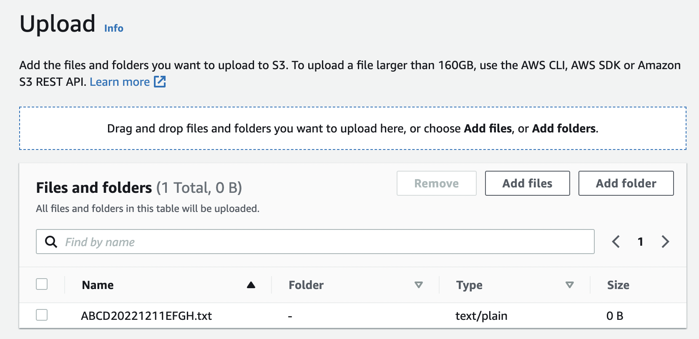
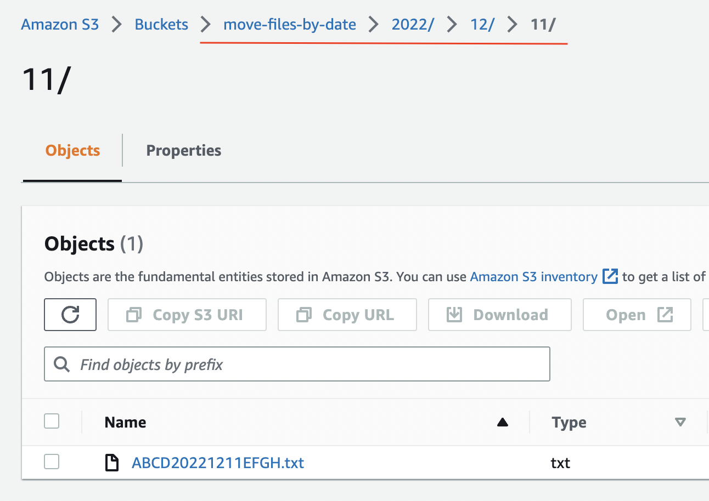

## S3 : moving files by date
 This lambda is an util which allows to classify automatically by date  any files which contains a date in the file name. \
the file name must contain the 'YYYYMMDD' date format and the lambda will create related keys based on year, month and day with the file.\
 The lambda function need to be triggered by a S3 event
### example:
It's an example with a manual upload

